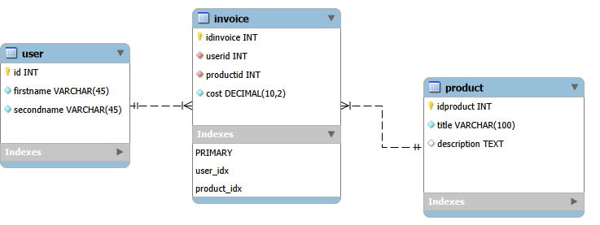
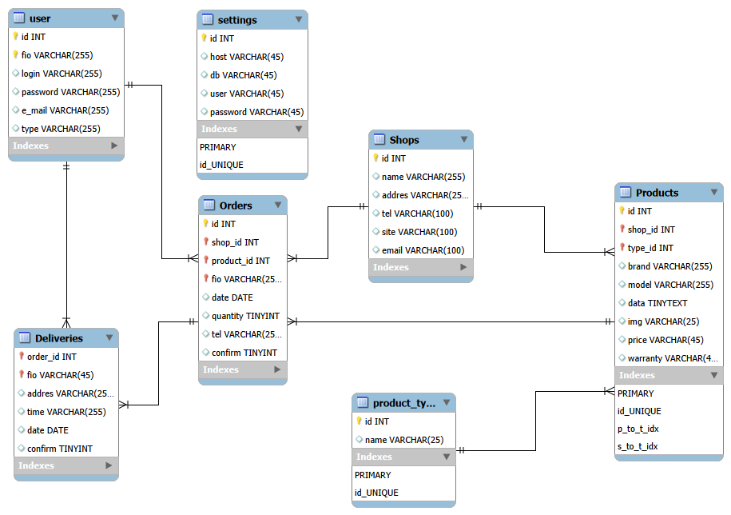

## Задание 1



Ссылка на запрос:
https://gist.github.com/ElizarovAlexandr/00052da0751a359bf4df56796dc7e6a6

Код создания таблицы invoice:
```sql
|CREATE TABLE IF NOT EXISTS `First_model`.`invoice` (|
|`idinvoice` INT NOT NULL AUTO_INCREMENT,|
|`userid` INT NOT NULL,|
|`productid` INT NOT NULL,|
|`cost` DECIMAL(10,2) NOT NULL,|
|PRIMARY KEY (`idinvoice`),|
|INDEX `user_idx` (`userid` ASC) VISIBLE,|
|INDEX `product_idx` (`productid` ASC) VISIBLE,|
|CONSTRAINT `user`|
|FOREIGN KEY (`userid`)|
|REFERENCES `First_model`.`user` (`id`)|
|ON DELETE CASCADE|
|ON UPDATE CASCADE,|
|CONSTRAINT `product`|
|FOREIGN KEY (`productid`)|
|REFERENCES `First_model`.`product` (`idproduct`)|
|ON DELETE CASCADE|
|ON UPDATE CASCADE)|
```
## Задание 2

Ссылка на запрос:
https://gist.github.com/ElizarovAlexandr/264c02b88a3e02f9004a2b4580b4def4
Orders:

```sql
|CREATE TABLE IF NOT EXISTS `mydb`.`Orders` (|
|`id` INT NOT NULL AUTO_INCREMENT,|
|`shop_id` INT NOT NULL,|
|`product_id` INT NOT NULL,|
|`fio` VARCHAR(255) NOT NULL,|
|`date` DATE NULL,|
|`quantity` TINYINT NULL,|
|`tel` VARCHAR(255) NULL,|
|`confirm` TINYINT NULL,|
|PRIMARY KEY (`id`, `shop_id`, `product_id`, `fio`),|
|UNIQUE INDEX `id_UNIQUE` (`id` ASC) VISIBLE,|
|INDEX `s_to_t_idx` (`shop_id` ASC) VISIBLE,|
|INDEX `p_to_t_idx` (`product_id` ASC) VISIBLE,|
|INDEX `u_to_u_idx` (`fio` ASC) VISIBLE,|
|CONSTRAINT `s_to_t`|
|FOREIGN KEY (`shop_id`)|
|REFERENCES `mydb`.`Shops` (`id`)|
|ON DELETE NO ACTION|
|ON UPDATE NO ACTION,|
|CONSTRAINT `p_to_t`|
|FOREIGN KEY (`product_id`)|
|REFERENCES `mydb`.`Products` (`id`)|
|ON DELETE NO ACTION|
|ON UPDATE NO ACTION,|
|CONSTRAINT `u_to_u`|
|FOREIGN KEY (`fio`)|
|REFERENCES `mydb`.`user` (`fio`)|
|ON DELETE CASCADE|
|ON UPDATE CASCADE)|
```
## Задание 3

